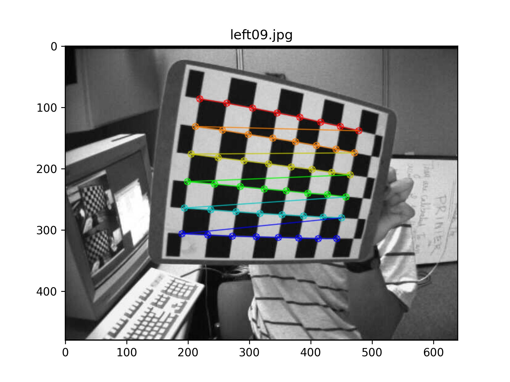

<h3 align="center">Camera Calibration</h3>

<div align="center">

[]()
[](https://github.com/mahaamesha/image-processing-notes/issues)
[](https://github.com/mahaamesha/image-processing-notes/pulls)
[](/LICENSE)

</div>

---

<p align="center"> I want to do camera calibration to get calibration properties. In addition, after i have these, i can undistort my test image.
    <br> 
</p>

## 📝 Table of Contents

- [About](#about)
- [Getting Started](#getting_started)
- [Usage](#usage)
- [Authors](#authors)
- [Acknowledgments](#acknowledgement)

## 🧐 About <a name = "about"></a>
Some pinhole cameras introduce significant distortion to images. Two major kinds of distortion are radial distortion and tangential distortion.

</img>

**Radial distortion** causes straight lines to appear curved. Radial distortion becomes larger the farther points are from the center of the image.

Radial distortion can be represented as follows:

$$
    x_{distorted} = x(1 + k_1 r^2 + k_2 r^4 + k_3 r^6) \\
    y_{distorted} = y(1 + k_1 r^2 + k_2 r^4 + k_3 r^6)
$$

**Tangential distortion** occurs because the image-taking lense is not aligned perfectly parallel to the imaging plane. So, some areas in the image may look nearer than expected. The amount of tangential distortion can be represented as below:

$$
    x_{distorted} = x + [2 p_1 xy + p_2 (r^2 + 2x^2)] \\
    y_{distorted} = y + [p_1 (r^2 + 2y^2) + 2p_2 xy]
$$

In short, we need to find five parameters, known as **distortion coefficients** given by:

$$
    Distortion coefficients = (
        \begin{matrix}
            k_1 & k_2 & p_1 & p_2 & k_3
        \end{matrix}
    )
$$

**Intrinsic parameters** are specific to a camera. They include information like focal length $(f_x,f_y)$ and optical centers $(c_x,c_y)$. It can be used to remove distortion due to the lenses of a specific camera. The camera matrix is unique to a specific camera, so once calculated, it can be reused on other images taken by the same camera. It is expressed as a 3x3 matrix:

$$
    camera matrix = \left[
        \begin{matrix}
            f_x & 0 & c_x \\
            0   & f_y & c_y \\
            0   & 0 & 1
        \end{matrix}
    \right]
$$

**Extrinsic parameters** corresponds to rotation and translation vectors which translates a coordinates of a 3D point to a coordinate system.


## 🏁 Getting Started <a name = "getting_started"></a>

These instructions will get you a copy of the project up and running on your local machine for development and testing purposes. See [deployment](#deployment) for notes on how to deploy the project on a live system.

### Prerequisites

What things you need to install the software and how to install them.

```
Give examples
```

### Installing

A step by step series of examples that tell you how to get a development env running.

Say what the step will be

```
Give the example
```

And repeat

```
until finished
```

End with an example of getting some data out of the system or using it for a little demo.

## 🔧 Running the tests <a name = "tests"></a>

Test program architecture
``` py
camera_calibration/:
    data/:
        calib_properties_.npz
    img/:
        calib_/:
            <calibration_images.jpg>
        result_/:
            <result_images.jpg>
        test_/:
            <test_images.jpg>
    test.py
```

[`im_found.jpg`](./img/result_/im_found.jpg)\
</img>\
**Fig x.** Distorted image with pattern drawn on it

[`im_compare.jpg`](./img/result_/im_compare.jpg)\
</img>\
**Fig x.** Comparison between (a) distorted image and (b) undistorted image

[`im_absdiff.jpg`](./img/result_/im_absdiff.jpg)\
</img>\
**Fig x.** Absolute difference between distorted and undistorted image


Below is the summary of the result of calibration
``` py
========== CALIBRATION PROPERTIES ==========

Ret: 0.17989164670236782

Camera matrix:
Type: <class 'numpy.ndarray'>
Shape: (3, 3)
[[532.89681128   0.         342.22771903]
 [  0.         533.00943292 234.53947215]
 [  0.           0.           1.        ]]

Distortion coefficients:
Type: <class 'numpy.ndarray'>
Shape: (1, 5)
[[-2.79126350e-01  1.93660883e-02  1.25547927e-03 -2.25070411e-05
   1.55094873e-01]]

Rotation vectors:
Type: <class 'numpy.ndarray'>
Shape: (11, 3, 1)
[[[ 0.41769431]
  [ 0.65664191]
  [-1.33641378]]

 [[-0.27889177]
  [ 0.18739243]
  [ 0.3550305 ]]

 [[-0.11259054]
  [ 0.23956433]
  [-0.00220022]]

 [[-0.29450616]
  [ 0.4294765 ]
  [ 1.31272903]]

 [[-0.31865366]
  [ 0.16151149]
  [-1.24092914]]

 [[-0.45412108]
  [-0.08749953]
  [-1.33600718]]

 [[ 0.20093673]
  [-0.42513057]
  [ 0.13269691]]

 [[-0.42041729]
  [-0.49797817]
  [ 1.33626276]]

 [[-0.24102689]
  [ 0.34810989]
  [ 1.53050812]]

 [[ 0.46557428]
  [-0.28487706]
  [ 1.23869442]]

 [[-0.17178584]
  [-0.46906138]
  [ 1.34672731]]]

Translation vectors:
Type: <class 'numpy.ndarray'>
Shape: (11, 3, 1)
[[[-2.23666129]
  [ 2.5622497 ]
  [13.44999205]]

 [[-0.67045742]
  [-3.67691725]
  [12.4334818 ]]

 [[-2.96370777]
  [-2.68343933]
  [12.92773712]]

 [[ 2.53669438]
  [-3.72122477]
  [12.16826045]]

 [[-5.96206956]
  [ 2.34449236]
  [16.74475248]]

 [[-3.53620898]
  [ 3.04104607]
  [11.40052829]]

 [[-2.65071568]
  [-3.21774998]
  [11.05664752]]

 [[ 1.87828973]
  [-4.41288962]
  [13.45290403]]

 [[ 2.03640781]
  [-3.14861165]
  [12.45879143]]

 [[ 1.35002774]
  [-3.63304008]
  [11.56754428]]

 [[ 1.80215329]
  [-4.30164281]
  [12.43104036]]]

*) `rvecs` and `tvecs` contains (3x1) vector for every image.

Re-projection error: 0.025770447672861817
*) The closer the re-projection error is to zero, the more accurate the parameters we found are.
```

## 🎈 Usage <a name="usage"></a>

Add notes about how to use the system.

## ✍️ Authors <a name = "authors"></a>

- [@mahaamesha](https://github.com/mahaamesha) - Idea & Initial work

## 🎉 Acknowledgements <a name = "acknowledgement"></a>

- Hat tip to anyone whose code was used
### Inspiration
### References